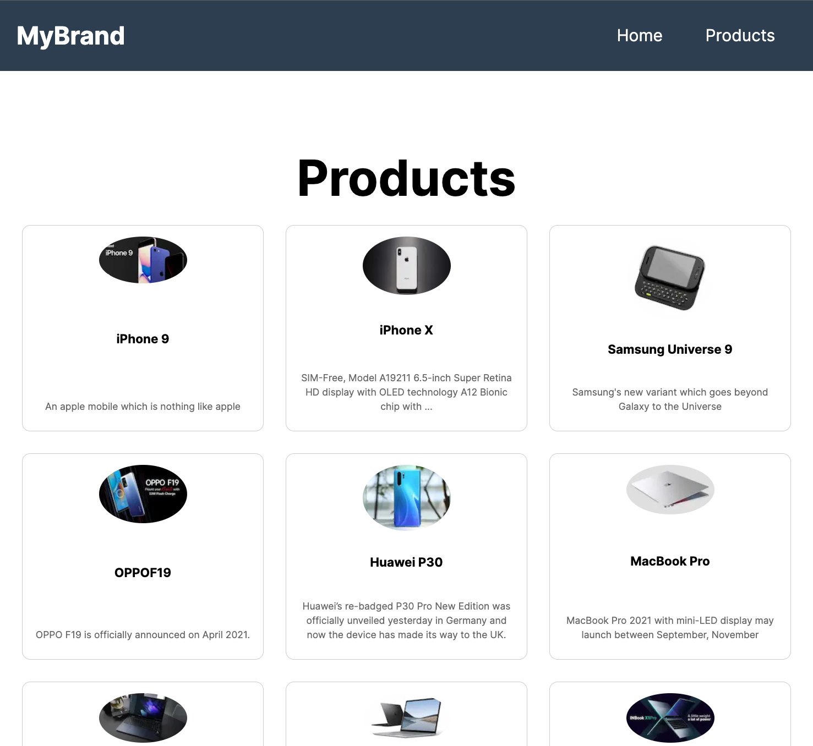

# Next.js Product Catalog 🛒



## Table of Contents

- [About](#about)
- [Features](#features)
- [Tech Stack](#tech-stack)
- [Getting Started](#getting-started)
- [Usage](#usage)
- [Contributing](#contributing)
- [License](#license)

## About

This is a Next.js project that serves as a product catalog. It fetches product data from a [Dummy API](https://dummyjson.com/docs/products) and displays it on the home page. Each product is clickable and leads to a dynamic page where more details about the product are shown.

## Features

- 📦 Fetch and display products from API
- 🎨 Beautifully styled product cards
- 🚀 Dynamic pages for each product
- 📱 Fully responsive design

## Tech Stack

- [Next.js](https://nextjs.org/)
- [React](https://reactjs.org/)
- [CSS Modules](https://github.com/css-modules/css-modules)
- [Tailwind CSS](https://tailwindcss.com/)

## Getting Started

### Prerequisites

- Node.js
- npm

### Installation

1. Clone the repo
   ```sh
   git clone https://github.com/AdrianGeorgeM/product-next.git
   ```
2. Install NPM packages
   ```sh
   npm install
   ```
3. Run the development server
   ```sh
   npm run dev
   ```

## Usage

Open [http://localhost:3000](http://localhost:3000) with your browser to see the result.

## License

Distributed under the MIT License. See `LICENSE` for more information.

---

Feel free to add or remove sections according to your project's needs. Adding screenshots, demo links, or even GIFs can make it more engaging.